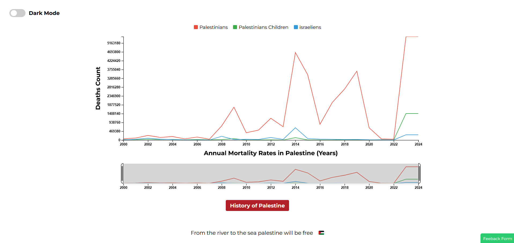

# Palestine-Annual-Death-Count-D3

an interactive data visualization project created with D3.js, focusing on annual death counts in Palestine.

## Overview :

This data visualization project utilizes D3.js to create an interactive multi-line diagram with a focus zone, providing a comprehensive view of annual death counts in Palestine. The interactive features enable users to explore and analyze the trends over time, gaining insights into the evolving patterns of mortality.

## Dark Mode :

## Light Mode :

## Dependencies :

-   D3.js (version 4)
